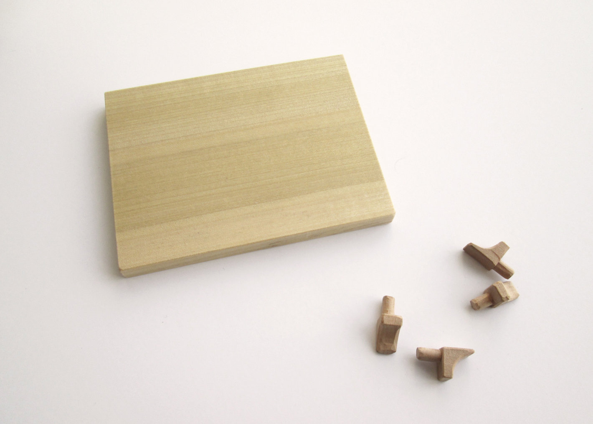

# Small Cabinet

Materials:  
Poplar, French Walnut, Bass.

<figure>
  
  <figcaption>
    Elevations of Small Cabinet:  
    Front, Left Side, Back, Right Side
  </figcaption>
</figure>

<figure>
  
  <figcaption>
    Recessed pull in cabinet door made with carving knife.
  </figcaption>
</figure>

<figure>
  
  <figcaption>
    Inside of cabinet.
  </figcaption>
</figure>

<figure>
  
  <figcaption>
    Shelf and pegs. Final shaping of pegs is done with carving knife.
  </figcaption>
</figure>

<figure>
  
  <figcaption>
    Brass hinges recessed into bottom of cabinet and door.
  </figcaption>
</figure>

<figure>
  
  <figcaption>
    Half blind dovetails in drawer front.
  </figcaption>
</figure>

<figure>
  
  <figcaption>
    Through dovetails in back of drawer.  
    Fit bottom with reveal.
  </figcaption>
</figure>

<figure>
  
  <figcaption>
    Wooden latch has a spring behind it to provide a friction fit when door is shut. Latch is adjustable with brass screw.
  </figcaption>
</figure>

<figure>
  
  <figcaption>
    Leveler is shaped with a carving knife. It is slightly higher then the bottom of the cabinet and prevents the door from sagging when closed.
  </figcaption>
</figure>

<figure>
  
  <figcaption>
    Brass wall hanger. Brass stock is cut to length then eased and squared with bench sander, holes are drilled and countersunk with drill press, groove for screw to raise into is created on mortising table.
  </figcaption>
</figure>